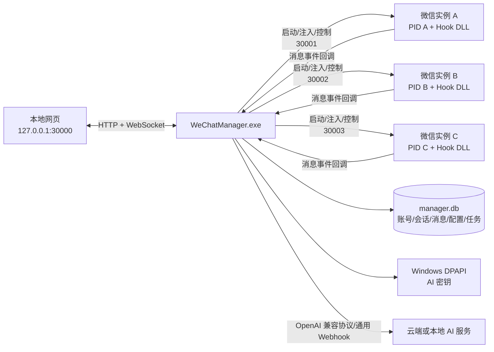
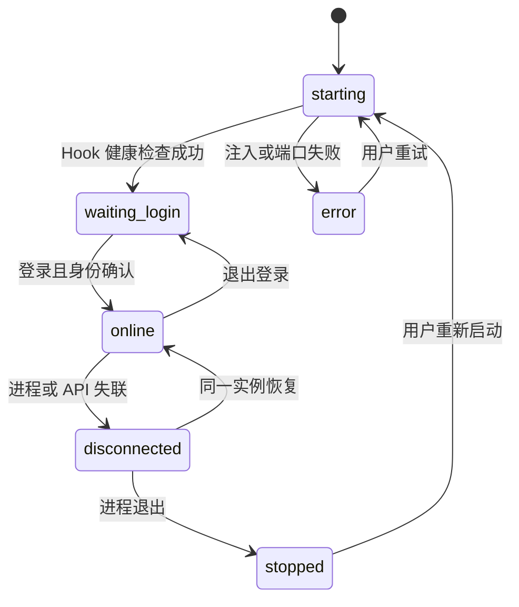
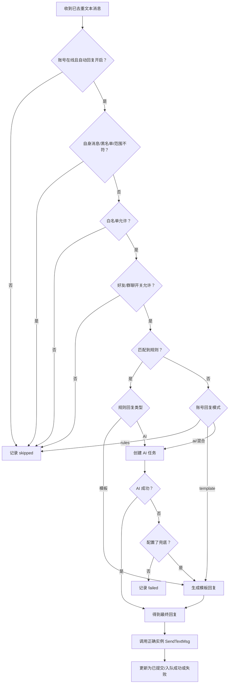

# WeChat-Hook 多账号管理器与本地网页方案

> 适用微信版本：`4.1.10.27`
>
> 目标项目：`WeChat-Hook`
>
> 文档性质：架构与实施方案，不包含代码实现
>
> 核心目标：将现有“单微信进程 + 单端口 API”升级为“多微信实例 + 多账号绑定 + 本地实时消息工作台 + 独立自动回复/AI/防撤回配置”。

## 1. 方案摘要

本方案新增一个独立的 `WeChatManager.exe`，统一承担以下职责：

1. 多开微信、给每个微信实例分配独立 API 端口，并把 Hook DLL 注入到准确的主进程。
2. 维护“实例、PID、端口、登录状态、真实 wxid、昵称”之间的绑定关系。
3. 在 `127.0.0.1` 提供一个固定入口的本地网页和统一管理 API。
4. 接收每个微信实例推送的实时消息，持久化后通过 WebSocket 推送到网页。
5. 按账号独立管理自动回复、好友/群聊开关、白名单、黑名单、关键词规则、AI 服务、防撤回和撤回提示。
6. 作为自动回复的唯一决策中心，异步调用规则引擎或 AI，再通过正确微信实例的发送 API 回复。
7. 提供 AI 配置、测试对话、调用状态、回复结果和错误诊断。

最终用户只访问一个地址，例如：

```text
http://127.0.0.1:30000
```

内部的微信实例分别运行在：

```text
微信实例 1 -> 127.0.0.1:30001
微信实例 2 -> 127.0.0.1:30002
微信实例 3 -> 127.0.0.1:30003
```

端口只作为内部路由信息存在。网页和外部调用方始终使用稳定的账号 ID，不需要记忆端口。

## 2. 建设目标

### 2.1 多账号管理

- 支持同时启动多个微信主进程。
- 每个微信进程加载独立的 Hook DLL 上下文。
- 每个实例使用唯一的 HTTP 端口和内部访问令牌。
- 登录后自动识别当前账号并绑定真实 `wxid_`。
- 支持账号退出、重新登录、换号登录和进程重启后的重新绑定。
- 网页实时显示每个账号的在线、未登录、异常和离线状态。

### 2.2 本地网页工作台

- 左侧：多个微信账号及运行状态。
- 中间：当前账号的会话列表。
- 右侧：当前会话的实时消息、发送框和自动回复结果。
- 可针对当前账号实时调整自动回复、防撤回和撤回提示。
- 提供账号级设置、AI 配置、规则编辑、联系人查看和运行诊断。
- 提供基于 OpenAPI/接口清单自动生成的 API 调试页面。

### 2.3 独立自动回复

每个账号拥有完全独立的：

- 自动回复总开关。
- 好友消息开关。
- 群聊消息开关。
- 群聊仅被 `@` 时回复开关。
- 白名单和黑名单。
- 关键词规则、匹配方式、优先级和回复模板。
- 默认回复策略。
- AI 服务、模型、提示词和上下文策略。
- 超时、冷却、频率限制和失败兜底。

所有运行时开关修改后立即生效，不要求重启微信。

### 2.4 独立防撤回

每个账号拥有独立的：

- 防撤回期望开关。
- 防撤回实际状态。
- 撤回灰条提示开关。
- 撤回事件记录和提示注入结果。

防撤回修改只作用于对应微信进程的虚拟地址空间，不影响其他实例。

## 3. 非目标

首期不把以下内容作为强制范围：

- 不改变已验证 Hook 的消息结构偏移。
- 不在 HTTP 线程中直接操作微信内部 SQLite 连接。
- 不在消息接收 Hook 内直接调用微信发送函数。
- 不承诺绕过微信服务端对账号登录数量、风控或异地登录的限制。
- 不把本地文本发送的“已入队”错误标记为“对方已送达”。
- 不在首期实现所有图片、语音、视频和文件的完整在线预览。
- 不允许管理网页从局域网或公网直接访问，远程管理另行设计。

## 4. 当前项目基础与缺口

| 能力 | 当前基础 | 主要缺口 |
| --- | --- | --- |
| 多开微信 | 已有独立“微信多开”程序，可关闭互斥体并启动微信 | 未与 Hook 注入、端口分配、账号绑定整合 |
| 实例端口 | DLL 已解析 `StartPort`，默认 `30001` | 当前启动器固定使用 `30001`，多实例会端口冲突 |
| 登录状态 | 已有登录完成和状态探针，暴露 `IsLogin` | 缺少管理器统一状态机和重连机制 |
| 账号资料 | 已有 `/GetSelfProfile` 和真实 wxid 解析基础 | 需要统一暴露可靠的 `account_uid`，避免把别名当成真实 wxid |
| 实时消息 | 已有安全 AddMsg 读取和异步回调 | 缺少统一接收、去重、持久化和 WebSocket 推送 |
| 文本发送 | 已有 `/SendTextMsg` 和独立发送线程 | 缺少按账号路由和发送任务状态展示 |
| 自动回复 | 已有规则、模板、黑白名单和好友/群聊开关 | 当前配置文件共享；没有 AI；没有统一网页 |
| 防撤回 | 已有运行时开关 | 缺少按账号持久化、期望/实际状态同步 |
| 撤回提示 | 已有独立运行时开关 | 缺少网页控制和依赖关系处理 |
| 本地网页 | `/` 仅返回服务 JSON | 缺少管理器 SPA、统一 API 和接口描述 |
| 安全 | HTTP 服务可运行 | 当前监听 `0.0.0.0`，缺少实例令牌和浏览器侧保护 |

## 5. 核心设计原则

### 5.1 微信进程只负责“采集与执行”

注入微信的 DLL 继续负责：

- 安装已经验证过的 Hook。
- 采集登录状态、账号资料和消息事件。
- 接收对应实例的发送请求。
- 执行防撤回和撤回提示开关。
- 提供进程级诊断数据。

不把复杂网页、AI SDK、长期消息存储和跨账号调度放进微信进程，降低崩溃面。

### 5.2 管理器负责“编排与决策”

管理器负责：

- 启动、注入、发现和监控微信实例。
- 端口、PID、实例和账号映射。
- 消息接收、去重、存储和实时推送。
- 自动回复规则计算。
- AI 调用和上下文管理。
- 将最终回复发送到正确的微信实例。
- 配置持久化、密钥保护和网页服务。

### 5.3 自动回复只能有一个执行所有者

管理模式下，由管理器作为自动回复的唯一决策与发送方。

为防止一条消息被回复两次：

- 管理器接管账号后，将该实例 DLL 内置自动回复总开关设置为关闭。
- DLL 仍保留现有 `/AutoReply/*` 接口，兼容单实例独立使用。
- 管理器自己的规则引擎负责模板、关键词和 AI 全部模式。
- 所有自动回复最终通过对应实例的 `/SendTextMsg` 下发。

如果未来提供“脱离管理器也能回复”的本地降级模式，必须显式切换执行所有者，禁止两个引擎同时开启。

### 5.4 配置区分“期望状态”和“实际状态”

例如用户为某账号配置：

```text
防撤回期望状态 = 开启
防撤回实际状态 = 实例离线，尚未应用
```

账号重新上线后，管理器自动应用期望状态，并根据实例 API 返回更新实际状态。

该模型同样适用于自动回复、防撤回、撤回提示和实例健康状态。

## 6. 总体架构



### 6.1 组件职责

| 组件 | 主要职责 |
| --- | --- |
| `WeChatManager.exe` | 多开、注入、端口分配、账号绑定、统一 API、WebSocket、规则引擎、AI、持久化 |
| Hook DLL | 微信进程内消息采集、状态采集、消息发送、防撤回和诊断 |
| 本地 SPA | 多账号工作台、实时会话、消息发送、规则和 AI 配置 |
| `manager.db` | 管理器自己的 SQLite 数据库，不复用微信实时数据库 |
| AI Provider Adapter | 对接 OpenAI 兼容接口、通用 Webhook 或本地模型 |

## 7. 多微信实例生命周期

### 7.1 启动流程

1. 管理器读取微信安装路径和 Hook DLL 路径。
2. 从端口池原子分配一个可用端口，例如 `30001`。
3. 生成不可预测的 `instance_id` 和内部访问令牌。
4. 使用挂起方式创建微信主进程，并传入：

   ```text
   StartPort=30001
   CallBackURL="http://127.0.0.1:30000/internal/events"
   RecvType=2
   ManagedMode=1
   InstanceId="ins_01..."
   InstanceToken="<随机令牌>"
   ```

5. 将 Hook DLL 注入新创建的准确 PID。
6. 恢复微信主线程。
7. 如果需要继续多开，关闭已存在实例的单实例互斥体后再启动下一个实例。
8. 轮询实例健康接口，确认端口真实监听成功。
9. 将实例状态从 `starting` 更新为 `waiting_login`。

不应再采用“枚举到第一个微信进程后注入”的方式，因为无法保证 PID 和端口映射正确。

`ManagedMode=1` 必须让 DLL 跳过旧 `autoreply.json` 的自动启用流程，确保管理器接管前不会被遗留配置触发回复。`InstanceToken` 可作为首期实现；加固版本应通过带当前用户 ACL 的命名管道完成一次性令牌交换，避免长期密钥出现在命令行中。

### 7.2 端口策略

- 管理器固定监听 `127.0.0.1:30000`。
- 微信实例端口默认从 `30001` 起分配。
- 分配前检查端口是否可绑定。
- 启动完成后必须执行 HTTP 健康握手。
- 实例 HTTP 服务绑定 `127.0.0.1`，不得继续绑定 `0.0.0.0`。
- 端口不是账号身份，实例重启后允许改变。

### 7.3 账号识别与绑定

登录前只能识别：

```text
instance_id + PID + port
```

登录后管理器读取：

- 登录状态。
- 真实内部 `wxid_`。
- 别名。
- 昵称。
- 头像。
- 联系人数据库账号目录。

绑定主键使用经过验证的真实 `wxid_`，不使用昵称、别名或临时端口。

建议新增统一身份接口，例如：

```http
GET /Instance/identity
```

返回：

```json
{
  "instance_id": "ins_01...",
  "pid": 12345,
  "port": 30001,
  "is_login": true,
  "account_uid": "wxid_xxx",
  "alias": "example",
  "nickname": "示例账号",
  "identity_verified": true
}
```

如果真实 wxid 尚未解析成功，管理器不得把别名永久绑定为账号主键。

### 7.4 实例状态机



### 7.5 换号与退出登录

当实例从账号 A 退出并登录账号 B 时：

1. 立即停止账号 A 在该实例上的自动回复任务。
2. 清除实例内旧会话资料缓存。
3. 将账号 A 标记为离线。
4. 重新解析账号 B 的真实 wxid。
5. 建立新绑定。
6. 加载账号 B 的独立配置。
7. 应用账号 B 的防撤回、撤回提示和自动回复期望状态。

禁止沿用账号 A 的 AI 上下文、黑白名单或规则。

## 8. 本地网页设计

### 8.1 三栏主工作台

```text
┌──────────────────┬──────────────────────┬──────────────────────────────────────┐
│ 左侧：微信账号    │ 中间：会话列表        │ 右侧：实时消息与操作                   │
│                  │                      │                                      │
│ ● 客服一号        │ 张三          10:32  │ 张三                                  │
│   在线 / AI开启   │ 你好，请问……          │ ─────────────────────────────────── │
│                  │                      │ 对方：你好                            │
│ ● 客服二号        │ 售后群        10:29  │ AI：正在生成回复……                   │
│   在线 / 规则模式 │ @客服 订单……          │ 我方：您好，请提供订单号              │
│                  │                      │                                      │
│ ○ 私人账号        │ 文件传输助手          │ [消息输入框                         ] │
│   未登录          │                      │ [发送] [自动回复] [防撤回] [更多设置] │
└──────────────────┴──────────────────────┴──────────────────────────────────────┘
```

### 8.2 左侧账号栏

每个账号卡片显示：

- 头像、昵称和脱敏 wxid。
- 在线、未登录、启动中、失联或异常状态。
- PID 和内部端口，默认折叠在诊断信息中。
- 自动回复状态：关闭、规则、AI、混合。
- 防撤回实际状态。
- 未读会话数和等待处理的 AI 任务数。

提供操作：

- 启动新微信。
- 重新连接实例。
- 打开对应微信窗口。
- 正常关闭微信实例。
- 重新启动实例。
- 进入账号设置。

默认使用正常关闭流程；强制结束进程必须二次确认。

### 8.3 中间会话列表

显示当前选中账号的：

- 好友私聊。
- 群聊。
- 文件传输助手。
- 最近消息摘要。
- 最后消息时间。
- 未读数量。
- 自动回复状态。
- AI 处理中、发送失败等状态徽标。

支持：

- 搜索联系人、群名或 wxid。
- 按未读、好友、群聊、AI 异常筛选。
- 置顶和本地归档。
- 仅展示管理器接入后捕获的实时消息。

历史消息首期从管理器自己的消息库读取，不在 HTTP 线程直接扫描微信 SQLite。

### 8.4 右侧消息面板

实时显示：

- 收到的文本消息。
- 自己发送的消息。
- 自动回复消息。
- AI 生成过程和最终结果。
- 图片、语音、视频、文件和 XML 卡片的类型占位或已解析内容。
- 撤回事件、拦截结果和撤回提示注入结果。
- 消息时间、发送者、群成员和消息状态。

底部提供：

- 文本输入框。
- 直接发送按钮。
- 当前会话自动回复临时开关。
- 当前账号自动回复总开关。
- 防撤回和撤回提示快捷开关。
- “交给 AI 生成”按钮。
- 回复草稿编辑和重新生成。

文本发送接口当前只能证明请求已进入本地发送队列，因此状态文案必须区分：

```text
生成完成 -> 已提交微信 -> 本地入队成功
```

不得在没有服务器回执时显示“对方已收到”。

### 8.5 账号设置页

设置页按账号独立展示：

1. 基础信息。
2. 自动回复策略。
3. 好友/群聊开关。
4. 白名单和黑名单。
5. 关键词规则。
6. AI 服务与模型。
7. 系统提示词。
8. 上下文和频率限制。
9. 防撤回和撤回提示。
10. 回调、健康和诊断信息。

### 8.6 API 调试页

在自定义工作台之外提供 API Explorer：

- 统一维护 OpenAPI 或等价的接口描述。
- 根据描述自动生成方法、路径、参数表单和响应展示。
- 支持选择账号后自动把请求路由到对应实例。
- 高风险或实验性接口单独分组并显示警告。
- 默认隐藏 Hook 诊断和逆向探针接口。

## 9. 实时消息链路

### 9.1 事件流程

1. 已验证的 AddMsg 读取点提取消息。
2. Hook 内只完成最小校验和异步入队。
3. DLL 异步 POST 到管理器内部事件入口。
4. 管理器鉴权并识别来源实例。
5. 规范化消息字段。
6. 去重并写入 `manager.db`。
7. 通过 WebSocket 推送到网页。
8. 将文本消息提交给自动回复决策队列。

### 9.2 规范化消息模型

```json
{
  "event_id": "evt_xxx",
  "instance_id": "ins_xxx",
  "account_uid": "wxid_self",
  "conversation_id": "wxid_friend_or_room",
  "message_id": "wechat_newmsgid",
  "direction": "incoming",
  "message_type": "text",
  "from_wxid": "wxid_friend",
  "to_wxid": "wxid_self",
  "room_wxid": "",
  "sender_wxid": "wxid_friend",
  "content": "你好",
  "wechat_timestamp": 0,
  "received_at": "2026-07-18T12:00:00+08:00",
  "raw_type": 1
}
```

群聊中：

- `conversation_id` 使用群 wxid。
- `room_wxid` 使用群 wxid。
- `sender_wxid` 使用群成员 wxid。

### 9.3 去重

优先使用以下组合：

```text
account_uid + newmsgid
```

如果某类消息没有可靠 `newmsgid`，使用受限时间窗口内的组合摘要：

```text
account_uid + conversation_id + sender + msgtype + content_hash + timestamp_bucket
```

去重必须在自动回复决策之前完成，避免同一消息触发多次 AI 调用或多次回复。

### 9.4 WebSocket 事件

建议统一事件类型：

- `instance.updated`
- `account.updated`
- `conversation.updated`
- `message.received`
- `message.sent`
- `message.recalled`
- `autoreply.job.updated`
- `ai.job.updated`
- `config.applied`
- `diagnostic.warning`

浏览器断开不影响微信消息接收和自动回复。浏览器重连后通过增量游标补取遗漏事件。

### 9.5 非文本消息

首期建议：

- 文本：完整显示并允许自动回复。
- 图片：显示类型、路径或缩略图状态；按现有解密能力逐步接入。
- 语音：显示类型和时长，后续接入转写。
- 文件/视频：显示名称、大小和本地状态。
- XML/appmsg：显示卡片摘要或原始类型。
- 系统/撤回消息：显示结构化事件。

AI 自动回复首期只对经过确认的普通文本消息生效。

## 10. 每账号独立配置模型

### 10.1 配置主键

所有账号配置使用：

```text
account_uid = 真实 wxid_
```

实例配置和账号配置分开：

- 实例配置：端口、PID、注入状态、令牌、健康状态。
- 账号配置：自动回复、AI、黑白名单、防撤回等长期策略。

### 10.2 自动回复模式

每个账号可选择：

| 模式 | 行为 |
| --- | --- |
| `off` | 不自动回复 |
| `template` | 始终使用默认模板 |
| `rules` | 只使用关键词规则；无匹配则不回复或使用可选兜底 |
| `ai` | 符合范围的消息直接调用 AI |
| `rules_then_ai` | 规则优先，无匹配时调用 AI |
| `ai_then_fallback` | AI 优先，失败时使用固定兜底模板 |
| `manual_review` | AI 只生成草稿，网页确认后发送 |

### 10.3 账号级基础开关

```json
{
  "enabled": true,
  "mode": "rules_then_ai",
  "friend_enabled": true,
  "group_enabled": false,
  "group_require_mention": true,
  "ignore_self": true,
  "default_template": "您好，已收到：{content}",
  "cooldown_seconds": 3,
  "max_replies_per_minute": 10
}
```

### 10.4 白名单和黑名单

支持以下对象：

- 好友 wxid。
- 群 wxid。
- 群成员 wxid。

决策顺序：

1. 黑名单优先，命中立即跳过。
2. 白名单非空时，只允许白名单对象。
3. 再判断好友/群聊开关。
4. 群聊按需判断是否被 `@`。

网页提供联系人搜索和批量导入，避免要求用户手工填写 wxid。

### 10.5 关键词规则

每条规则包含：

```json
{
  "id": "rule_xxx",
  "name": "查询营业时间",
  "enabled": true,
  "priority": 100,
  "scope": "all",
  "match": "contains",
  "keyword": "营业时间",
  "reply_type": "template",
  "template": "我们的营业时间是 09:00-18:00",
  "stop_after_match": true
}
```

匹配方式：

- 包含。
- 完全等于。
- 前缀。
- 后缀。
- 正则表达式。

模板变量：

- `{content}`
- `{sender}`
- `{room}`
- `{account}`
- `{nickname}`

规则必须有稳定 ID 和优先级，不能只依赖数组下标删除。

### 10.6 自动回复决策流程



## 11. AI 自动回复

### 11.1 AI 调用位置

AI 调用只在 `WeChatManager.exe` 内执行：

- 不在 Hook 回调线程调用。
- 不在微信进程内等待网络。
- 不把 API Key 下发给 DLL。
- 不把 API Key返回给浏览器。

### 11.2 Provider 类型

首期建议支持两类：

1. OpenAI 兼容接口：
   - `base_url`
   - `api_key`
   - `model`
   - Chat Completions 或项目选定的统一协议
2. 通用 Webhook：
   - 管理器 POST 标准消息 JSON
   - 外部服务返回标准回复 JSON

这样可接入云端模型、本地模型、企业内部 AI、工作流平台或自建服务。

### 11.3 每账号 AI 配置

```json
{
  "provider_id": "provider_local_01",
  "model": "model-name",
  "system_prompt": "你是售后客服，请使用简洁中文回答。",
  "temperature": 0.3,
  "max_output_tokens": 500,
  "context_message_count": 12,
  "timeout_ms": 20000,
  "fallback_template": "已收到您的消息，稍后人工回复。",
  "send_mode": "automatic"
}
```

其中 `send_mode` 支持：

- `automatic`：AI 成功后自动发送。
- `manual_review`：只生成草稿，网页确认后发送。

### 11.4 上下文隔离

上下文主键：

```text
account_uid + conversation_id
```

群聊可进一步保留：

```text
room_wxid + sender_wxid
```

必须保证：

- 不同微信账号之间不共享上下文。
- 不同好友之间不共享上下文。
- 群聊上下文不会误用到私聊。
- 账号退出或换号后，旧上下文不会绑定到新账号。

### 11.5 AI 任务状态

建议任务状态：

```text
queued
filtering
matched_rule
calling_ai
ai_succeeded
ai_failed
waiting_review
sending
submitted_to_wechat
send_failed
skipped
cancelled
```

网页实时显示：

- 使用的账号和会话。
- 命中的规则。
- 使用的 Provider 和模型。
- 排队、调用和总耗时。
- AI 原始结果和最终发送文本。
- 超时、限流、解析或发送错误。
- 是否使用了兜底模板。

### 11.6 AI 测试对话

账号设置中提供独立测试页：

- 选择账号配置和模型。
- 输入测试消息。
- 可模拟好友或群聊。
- 显示最终拼装的系统提示词和上下文摘要。
- 显示 AI 原始响应、解析结果、耗时和错误。
- 默认不发送到微信。
- 用户点击“发送到当前会话”后才调用微信发送 API。

测试模式不得写入真实会话上下文，除非用户显式选择。

### 11.7 安全和成本控制

- API Key 使用 Windows DPAPI 加密后存储。
- 浏览器只看到 Key 是否已配置和末尾脱敏字符。
- 支持账号级、会话级冷却。
- 支持每分钟回复数、并发数和每日调用上限。
- AI 超时后不阻塞后续消息。
- 账号离线后取消尚未开始的发送任务。
- 防止自身消息触发机器人循环。
- 支持敏感会话禁止调用外部 AI。

## 12. 防撤回与撤回提示

### 12.1 独立控制

管理器将账号配置路由到当前绑定实例：

```text
账号 A -> 实例端口 30001 -> /AntiRevoke/config
账号 B -> 实例端口 30002 -> /AntiRevoke/config
```

每个微信进程拥有独立代码页，因此账号 A 开启不会修改账号 B。

### 12.2 开关依赖

- 防撤回可以单独开启。
- 撤回提示依赖防撤回。
- 如果关闭防撤回，网页应提示撤回提示将无法发挥预期作用。
- 可选择自动联动关闭撤回提示，或保留期望值但标记为未应用。

### 12.3 状态展示

每个账号展示：

- 防撤回期望状态。
- 防撤回实际状态。
- 撤回提示期望状态。
- 撤回提示实际状态。
- 最近应用时间。
- 最近错误。
- 最近撤回事件和拦截结果。

### 12.4 重启恢复

微信进程退出后内存补丁自然消失。管理器保留账号期望配置，在同一账号重新上线、登录稳定并完成身份确认后再重新应用。

重新应用仍必须遵守项目规则：

- 只使用已经验证的版本和偏移。
- 修改前校验目标字节。
- 可逆恢复。
- Hook 和原函数返回值保持透传。

## 13. 数据存储

### 13.1 存储位置

建议使用：

```text
%LOCALAPPDATA%\WeChat-Hook-Manager\
├─ manager.db
├─ logs\
├─ cache\
└─ exports\
```

不再把多账号配置统一写到微信安装目录的 `autoreply.json`。

### 13.2 建议数据表

| 表 | 用途 |
| --- | --- |
| `instances` | instance_id、PID、端口、令牌、状态、版本、最近心跳 |
| `accounts` | 真实 wxid、昵称、别名、头像、最近登录实例 |
| `account_settings` | 自动回复、防撤回、撤回提示等账号级设置 |
| `reply_rules` | 规则、优先级、作用范围和模板 |
| `allowlist_entries` | 白名单 |
| `blocklist_entries` | 黑名单 |
| `ai_providers` | AI 服务地址、模型默认值和加密密钥引用 |
| `account_ai_settings` | 账号选择的 Provider、模型、提示词和上下文策略 |
| `conversations` | 账号下的好友或群聊会话 |
| `messages` | 规范化实时消息和本地发送记录 |
| `reply_jobs` | 规则/AI/发送任务状态 |
| `events` | 可审计的配置和运行事件 |

### 13.3 保留策略

- 支持按天数或最大容量清理本地消息。
- 支持关闭消息正文持久化，只保留实时显示。
- AI 请求日志可选择脱敏或关闭。
- 不默认保存完整 API Key。
- 支持按账号清除本地数据和 AI 上下文。

## 14. 管理器 API 设计

统一前缀：

```text
/api/v1
```

### 14.1 实例与账号

| 方法 | 路径 | 用途 |
| --- | --- | --- |
| `GET` | `/instances` | 获取全部微信实例 |
| `POST` | `/instances` | 启动一个新微信实例 |
| `GET` | `/instances/{instanceId}` | 获取实例详情和健康状态 |
| `POST` | `/instances/{instanceId}/restart` | 重启实例 |
| `POST` | `/instances/{instanceId}/close` | 正常关闭实例 |
| `GET` | `/accounts` | 获取全部已绑定账号 |
| `GET` | `/accounts/{accountUid}` | 获取账号详情 |

### 14.2 会话与消息

| 方法 | 路径 | 用途 |
| --- | --- | --- |
| `GET` | `/accounts/{accountUid}/conversations` | 会话列表 |
| `GET` | `/accounts/{accountUid}/conversations/{conversationId}/messages` | 分页消息 |
| `POST` | `/accounts/{accountUid}/conversations/{conversationId}/messages` | 直接发送文本 |
| `GET` | `/events/ws` | WebSocket 实时事件 |

### 14.3 自动回复

| 方法 | 路径 | 用途 |
| --- | --- | --- |
| `GET` | `/accounts/{accountUid}/autoreply` | 获取账号自动回复配置 |
| `PUT` | `/accounts/{accountUid}/autoreply` | 更新配置并实时生效 |
| `GET` | `/accounts/{accountUid}/reply-rules` | 获取规则 |
| `POST` | `/accounts/{accountUid}/reply-rules` | 新增规则 |
| `PUT` | `/accounts/{accountUid}/reply-rules/{ruleId}` | 更新规则 |
| `DELETE` | `/accounts/{accountUid}/reply-rules/{ruleId}` | 删除规则 |
| `PUT` | `/accounts/{accountUid}/allowlist` | 更新白名单 |
| `PUT` | `/accounts/{accountUid}/blocklist` | 更新黑名单 |

### 14.4 防撤回

| 方法 | 路径 | 用途 |
| --- | --- | --- |
| `GET` | `/accounts/{accountUid}/revoke-settings` | 获取期望和实际状态 |
| `PUT` | `/accounts/{accountUid}/revoke-settings` | 实时修改防撤回和撤回提示 |

### 14.5 AI

| 方法 | 路径 | 用途 |
| --- | --- | --- |
| `GET` | `/ai/providers` | 获取 Provider 列表 |
| `POST` | `/ai/providers` | 新增 Provider |
| `PUT` | `/ai/providers/{providerId}` | 修改 Provider |
| `POST` | `/ai/providers/{providerId}/test` | 测试连接 |
| `GET` | `/accounts/{accountUid}/ai-settings` | 获取账号 AI 配置 |
| `PUT` | `/accounts/{accountUid}/ai-settings` | 更新账号 AI 配置 |
| `POST` | `/accounts/{accountUid}/ai-test` | 测试对话，不自动发送 |
| `GET` | `/reply-jobs` | 查询规则、AI 和发送任务 |

### 14.6 内部接口

内部接口只允许微信实例访问：

| 方法 | 路径 | 用途 |
| --- | --- | --- |
| `POST` | `/internal/events` | 接收消息、撤回和状态事件 |
| `POST` | `/internal/heartbeat` | 实例心跳 |
| `POST` | `/internal/register` | 实例启动注册 |

内部接口必须校验实例令牌、PID、端口和已登记的 `instance_id`。

## 15. 配置实时生效

### 15.1 只影响管理器的配置

以下配置写入数据库并通过原子配置快照立即替换：

- 自动回复总开关。
- 好友/群聊开关。
- 白名单和黑名单。
- 关键词规则。
- AI Provider、模型和提示词。
- 冷却和频率限制。

新进入决策队列的消息立即使用新配置。已经开始调用 AI 的任务默认继续使用创建任务时的配置快照，避免中途行为变化。

### 15.2 需要下发到微信实例的配置

以下配置需要调用实例 API：

- 防撤回。
- 撤回提示。
- 手工发送消息。

网页先显示“应用中”，收到实例确认后再显示实际状态。失败时保留期望状态并显示错误，不做假成功。

## 16. 安全要求

### 16.1 网络边界

- 管理器和实例 HTTP 服务全部只监听 `127.0.0.1`。
- 浏览器只访问管理器端口。
- 实例端口不直接暴露给网页 JavaScript。
- 管理器代理所有实例调用，避免 CORS 和端口泄漏。

### 16.2 鉴权

- 每个实例使用独立随机令牌。
- 管理器网页使用同源会话和 CSRF 防护。
- 高风险接口要求二次确认。
- 实验性逆向探针接口默认不映射到普通网页。

### 16.3 密钥

- AI Key 使用 DPAPI 加密。
- API 返回只显示是否已配置和脱敏尾部。
- 日志不得输出完整 Key、Authorization Header 或完整敏感提示词。

### 16.4 微信进程安全

- 接收 Hook 内禁止重入发送。
- AI 网络请求禁止进入微信进程。
- HTTP 线程禁止直接操作微信内部 SQLite 句柄。
- 只使用已在 IDA 和运行时验证的 Hook 偏移。
- Hook 必须透传原函数返回值。

## 17. 故障恢复

### 17.1 端口占用

- 启动前检测。
- 启动后健康握手。
- 监听失败时释放实例记录并换端口重试。
- DLL 的 HTTP 启动结果需要能够反馈真实监听失败，而不是仅表示线程已创建。

### 17.2 微信崩溃或退出

- 通过进程句柄和心跳双重判断。
- 将账号标记为离线。
- 取消未开始的发送任务。
- 保留消息和期望配置。
- 用户重新启动同一账号后自动恢复。

### 17.3 管理器重启

- 扫描仍在运行的微信主进程。
- 从持久化实例记录尝试健康连接。
- 校验 PID 创建时间，避免 PID 重用。
- 重新获取登录状态和真实账号。
- 重新建立 WebSocket 和回调关系。

### 17.4 AI 故障

- 超时后标记 `ai_failed`。
- 根据账号配置使用兜底模板或转人工。
- 不阻塞同账号其他会话。
- 同一会话保持顺序，避免后到消息先回复。

## 18. 代码改造范围

### 18.1 新增管理器项目

建议新增：

```text
manager/
├─ WeChatManager.vcxproj
├─ src/
│  ├─ instance_manager.*
│  ├─ process_launcher.*
│  ├─ injector.*
│  ├─ account_registry.*
│  ├─ event_receiver.*
│  ├─ message_store.*
│  ├─ reply_engine.*
│  ├─ ai_provider.*
│  ├─ api_server.*
│  └─ websocket_hub.*
└─ web/
   ├─ index.html
   ├─ assets/
   └─ openapi.json
```

管理器可复用：

- 现有注入启动器的挂起启动和 DLL 注入逻辑。
- “微信多开”程序的安装路径探测和互斥体关闭逻辑。
- 项目现有 HTTP/JSON/SQLite 基础库。

### 18.2 Hook DLL 调整

建议只做必要的控制面调整：

- HTTP 监听从 `0.0.0.0` 改为 `127.0.0.1`。
- 增加实例 ID、PID、端口和真实账号身份接口。
- 增加内部访问令牌校验。
- 改进 HTTP 监听失败反馈。
- 消息回调携带稳定事件 ID、实例 ID、账号 ID和消息 ID。
- 管理模式下关闭 DLL 本地自动回复，防止重复。
- 保留现有单实例 API 兼容性。

这些调整不要求新增未知消息 Hook。

### 18.3 现有配置迁移

首次启动管理器时：

1. 检测旧 `autoreply.json`。
2. 在用户确认后导入指定账号。
3. 转换规则 ID 和优先级。
4. 备份旧文件。
5. 后续以 `manager.db` 为主配置源。

## 19. 分阶段实施计划

### 阶段 1：多实例基础

交付：

- 合并多开和注入能力。
- 每实例独立端口。
- 实例注册、健康检查和状态机。
- 登录后绑定真实账号。
- 管理器基础 API。

验收：

- 同时启动至少两个微信实例。
- 两个实例分别登录不同账号。
- 两个端口均可独立返回正确登录状态和个人资料。
- 任一实例重启不影响另一个实例。

### 阶段 2：本地网页和实时消息

交付：

- 固定本地网页入口。
- 左账号、中会话、右消息三栏布局。
- 实时事件接收、去重、存储和 WebSocket。
- 当前账号直接发送文本。

验收：

- 两个账号同时收到消息时，网页正确归属。
- 连续消息不遗漏、不重复。
- 切换账号后只显示该账号会话。
- 浏览器刷新后可恢复本地消息。

### 阶段 3：账号级规则和防撤回

交付：

- 独立自动回复总开关。
- 好友/群聊开关。
- 白名单、黑名单和规则编辑。
- 防撤回和撤回提示实时控制。
- 期望状态和实际状态。

验收：

- 账号 A 开启自动回复、账号 B 关闭时互不影响。
- 账号 A 开启防撤回、账号 B 关闭时互不影响。
- 微信重启后按账号恢复期望配置。
- 换号登录不继承上一个账号配置。

### 阶段 4：AI 自动回复

交付：

- OpenAI 兼容 Provider。
- 通用 Webhook Provider。
- 每账号模型、提示词和上下文。
- 规则优先、AI 优先和人工审核模式。
- AI 测试对话和任务状态。

验收：

- 不同账号可配置不同 AI 服务和提示词。
- 上下文严格按账号和会话隔离。
- AI 超时不阻塞微信和其他会话。
- 网页实时显示 AI 调用和实际发送状态。

### 阶段 5：稳定性和发布

交付：

- 异常恢复。
- 安全加固。
- OpenAPI 文档和自动 API Explorer。
- 日志、导出、数据清理和安装包。
- 多账号真实运行回归。

## 20. 测试矩阵

### 20.1 多实例

- 1、2、3 个微信实例启动。
- 端口被占用。
- 注入失败。
- 微信子进程误识别保护。
- 管理器重启后重新发现实例。

### 20.2 登录与账号绑定

- 启动但未登录。
- 两个实例登录不同账号。
- 退出登录。
- 同一实例换号。
- 微信完全重启。
- 真实 wxid 暂未解析成功。

### 20.3 实时消息

- 好友连续文本。
- 多账号同时收消息。
- 群聊及群成员拆分。
- 自身消息。
- 重复 Hook 观察事件。
- 图片、语音、文件和 XML 类型。
- 撤回事件。

### 20.4 自动回复

- 总开关。
- 好友和群聊独立开关。
- 群聊仅被 `@` 回复。
- 白名单和黑名单优先级。
- 每种规则匹配方式。
- 冷却、限频和自身消息过滤。
- 多账号不同规则。

### 20.5 AI

- 正常响应。
- 超时。
- 限流。
- 非法 JSON。
- 空回复。
- 人工审核。
- 兜底模板。
- 多会话并发和同会话顺序。
- 账号离线时取消发送。

### 20.6 防撤回

- 账号 A 开、账号 B 关。
- 文本撤回。
- 图片撤回。
- 撤回提示开关。
- 微信重启后恢复。
- 目标字节不匹配时安全失败。

## 21. 风险与应对

| 风险 | 应对 |
| --- | --- |
| 多实例端口冲突 | 管理器原子分配、启动前检测、启动后握手 |
| PID 绑定错误 | 使用 CreateProcess 返回的准确 PID和创建时间 |
| 账号别名被当作 wxid | 只在 `identity_verified=true` 后建立长期绑定 |
| 同一消息重复回复 | 统一事件去重，管理器成为唯一自动回复执行者 |
| 多进程共享旧配置文件 | 配置迁移到管理器数据库并按真实账号隔离 |
| AI 卡住微信 | AI 仅在外部管理器异步调用 |
| AI Key 泄漏 | DPAPI、脱敏返回、日志过滤 |
| 换号后串配置 | 登录状态机解绑旧账号，再加载新账号配置 |
| 防撤回版本偏移失效 | 版本锁定、字节校验、失败不修改 |
| 网页误报送达 | 明确区分生成、提交、入队和服务端送达 |
| 局域网误访问 | 所有服务只绑定 `127.0.0.1` |

## 22. 最终验收标准

满足以下条件可认为方案完整落地：

1. 一个管理器可稳定启动、注入和管理多个微信实例。
2. 每个实例拥有独立端口，并自动绑定正确真实微信账号。
3. 用户只需打开一个本地网页。
4. 左侧可切换多个微信账号，中间显示对应会话，右侧实时显示消息。
5. 可针对当前账号和会话直接发送消息。
6. 每个账号可独立实时控制自动回复、好友/群聊、白名单和黑名单。
7. 每个账号可独立实时控制防撤回和撤回提示。
8. 每个账号可独立配置 AI 服务、模型、提示词、上下文和兜底策略。
9. 网页可执行 AI 测试对话，并实时显示 AI 与发送任务状态。
10. 多账号之间不会串消息、串配置、串 AI 上下文或串发送目标。
11. 微信退出、换号、崩溃和重启后能够安全恢复，不使用旧会话对象。
12. 所有 Hook 修改继续遵守已验证偏移、返回值透传和真实进程回归规则。
